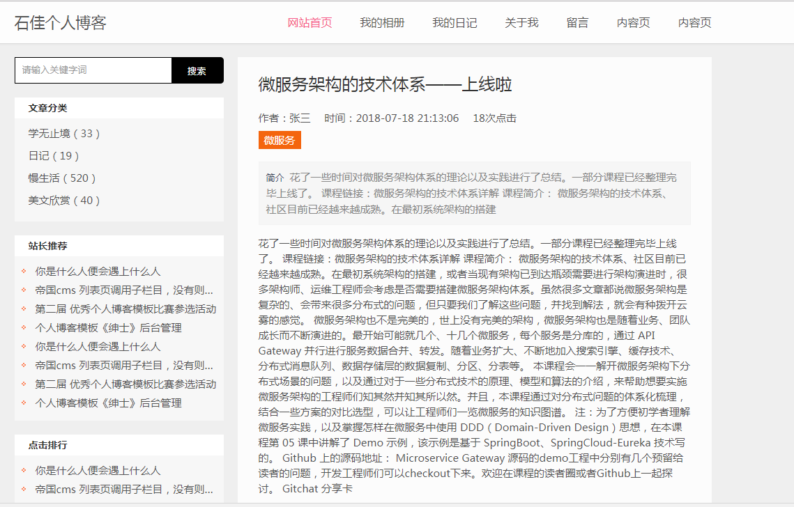
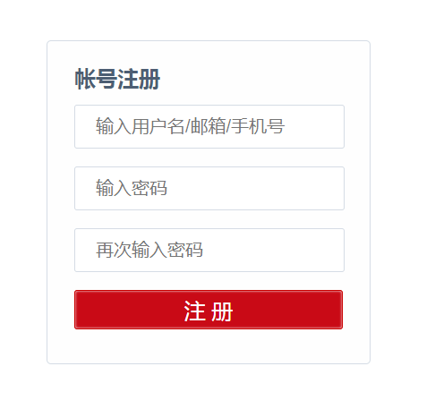
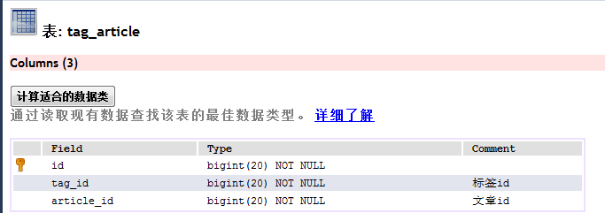
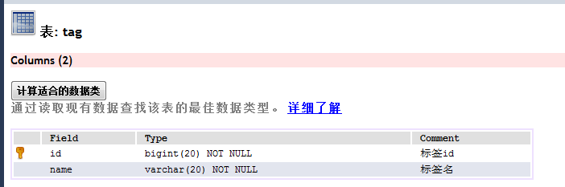
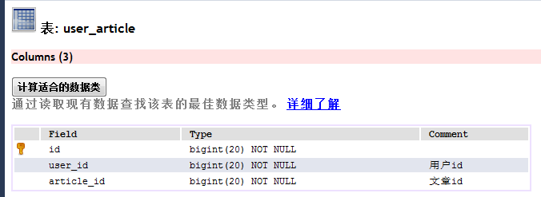
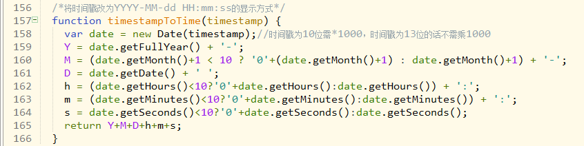
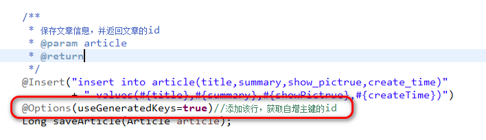
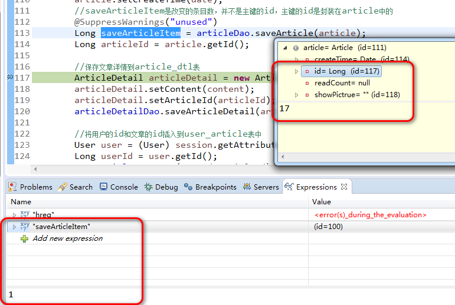
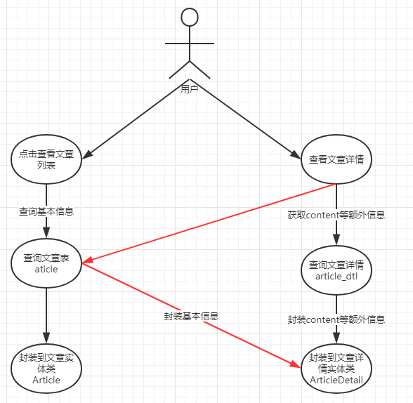

# 简介  
这个个人博客是我利用业余时间写出来的一个全栈项目，是第一个项目级别的作品，还在开发中，不足之处请多指教  
### 说明  
为了节省开发时间，部分前端内容来之网上的网页模板  
项目持续维护中，暂时有很多不妥的地方，比如密码加密，用户权限控制等等，后面会持续改进  
### 项目用到的框架，技术等  
工具：eclipse,hbuilder,sqlyog,gitdesktop  
后端框架和技术：java,springboot,mybatis,thymeleaf  
前端框架和技术：css,js,jquery  
其他：mysql  
### 运行  
运行项目中的sql文件，位置在other/sql/1.sql，修改src/main/resources/application.yml中的数据库账户密码为你自己的mysql账户密码  
项目导入到编译器，运行BlogApplication.java，片刻后访问http://localhost/，可以登录，账户密码为张三/123456  
# 预览  
首页（未登陆）  
  
首页（已登陆）  
  
文章页  
  
登陆页  
  
注册页  
  
# 接口  
### 文章模块  
获取文章信息列表{"post","/article/getArticles","","$Result"}  
跳转到文章详情页面{"get","/article/detail/${articleId}","","/article/detail"}  
获取文章详情{"post","/article/detail/${articleId}","","$Result"}  
跳转到写文章页面{"get","/article/write","","/article/write"}  
保存写好的文章{"post","/article/write","$content,$title,$showPictrue","$Result"}  
删除文章{"post","/article/delete","$articleId","$Result"}  
跳转到修改文章页面{"get","/article/update/${articleId}","","/article/update"}  
修改文章{"post","/article/update","$articleId,$content,$title,$showPictrue","$Result"}  
### 用户模块  
获取用户介绍{"post","/user/getUserIntroduce","","$Result"}  
跳转到登陆页面{"get","/user/login","","/user/login"}  
跳转到注册页面{"get","/user/regist","","/user/regist"}  
执行登陆验证{"post","/user/login","$username,$password","$Result"}  
执行注册验证{"post","/user/regist","$username,$password,$rePassword","$Result"}  
获取当前用户{"post","/user/getUser","","$Result"}  
注销当前登录{"get","/user/logout","","$Result"}  
这个地方不清楚为什么不能用post，显示退出不支持post  
# 数据库字段  
article_dtl文章详情表  
  
article文章表  
  
tag_article标签文章中间表  
  
tag标签表  
  
user_article用户文章表  
  
user_dtl用户详情表  
  
user用户表  
  
# 小技巧  
### 代码和数据库命名转换  
开启驼峰命名转换，将java中的驼峰命名和数据库中的xx_xx字段自动进行转换  
mybatis.configuration.map-underscore-to-camel-case: true  
### 前台页面显示时间为时间戳的解决办法  
后台查出的时间默在前台用时间戳显示，通过前台调用js方法，将时间戳改变成YYYY-MM-dd HH:mm:ss的显示方式  
  
### 获取插入时的自增主键  
在插入时获取自增主键的id  
在dao的方法上加上一句这样的注解	@Options(useGeneratedKeys=true)//添加该行，product中的id将被自动添加  
然后程序就会在运行的时候获取到主键，主键是封装在实体类内容的，可以直接获取  
另一方面直接返回的是修改的栏目条数，并不是我们需要的主键    
  
  
# 设计
##### 文章详情的设计，优化网络传输
文章内容的设计，因为在加载文章列表的时候不需要加载所有的文章内容，设法将加载文章列表和加载文章详情的内容分开  
设置两个实体类和两个表。文章实体类和文章详情实体类。文章详情实体类尽可能冗余文章实体类中的内容，以便加载文章详情的时候可以将所有文章信息填充进去  
文章表和文章详情表则尽可能不冗余，减少数据的冗余，具体实现过程如下图  
  
# 版本和需求  
##### v1.0.20180829.001  
用户写完文章后，直接跳转到首页  
##### v1.0.20180831.001  
进入文章后，可以让用户重新编辑文章和删除文章  
##### v1.0.20180901.001  
优化网站头部显示  
用户退出时可以直接跳转到首页  
