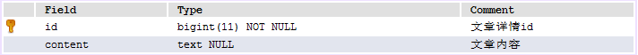
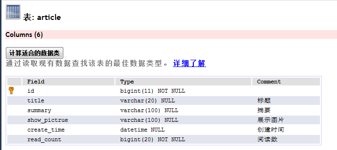
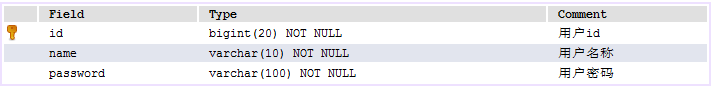
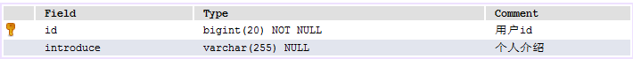

#基于springboot的个人博客系统
我希望有一个个人的博客系统，这个是我利用业余时间写出来的一个全栈程序，是第一个项目级别的作品，还在开发中，不足之处请多指教  
#预览
  
#接口  
###文章模块
获取文章信息列表{"post","/article/getArticles","","$Result"}  
跳转到文章详情{"get","/article/detail/${articleId}","","/article/detail"}  
获取文章详情{"post","/article/detail/${articleId}","","$Result"}  
###用户模块
获取用户介绍{"post","/user/getUserIntroduce","","$Result"}  
跳转登陆页面{"get","/user/login","","/user/login"}  
跳转注册页面{"get","/user/regist","","/user/regist"}  
执行登陆验证{"post","/user/login","$username,$password","$Result"}  
执行注册验证{"post","/user/regist","$username,$password,$rePassword","$Result"}  
获取当前用户{"post","/user/getUser","","$Result"}  
#数据库字段
article_dtl  
  
article  
  
user  
  
user_dtl  
  
